> 예전에 혼자 만든 Streamlit 대시보드 **Markov Regime Terminal**을 Claude Code 하네스 플러그인 **ECC**(v2.2.2)의 오케스트레이션 기능으로 다시 구현했다. 에이전트 26개가 감사하고, 설계하고, TDD로 구현하고, 리뷰했다. 이 글은 무엇이 바뀌었는지 다이어그램으로 비교하고, 과정에서 잘못된 일들도 함께 기록한다.
{: .prompt-info }

**TL;DR**

| | v1 (before) | v2 (after, ECC) |
|---|---|---|
| 구조 | 4개 파일, `app.py` 727줄에 UI·데이터·분석이 섞여 있음 | `domain` / `data` / `ui` 3계층, 파일 32개 (최대 309줄) |
| 테스트 | **0개** | **148개, 커버리지 98.2%** |
| 백테스트 결함 | 숏 이중 수수료, 수수료를 무시한 Sharpe, `total_fees` = 손익 합계 등 | 전부 회귀 테스트로 고정한 뒤 수정 |
| 최대 중첩 / 최장 함수 | 7단계 / 117줄 | 4단계 / 49줄 |
| 보안 | 외부 IP까지 노출, 이스케이프 없는 HTML | 127.0.0.1 바인딩, 입력 allow-list, `html.escape` |
| 분석 속도 (SPY 10년) | 1.5초 | **0.76초** (중간에 57.9초짜리 회귀가 있었다. 8장 참고) |

---

## 1. 출발점: v1 "Markov Regime Terminal"

v1은 해외 주식·ETF·코인 가격을 **Bull / Bear / Sideways** 3개 레짐으로 나누고, 레짐 전이행렬로 다음 날 시그널을 만들어 모의투자 성과를 보여 주는 대시보드다.

- **레짐 라벨링**: 20거래일 롤링 수익률이 +2%를 넘으면 Bull, −2% 미만이면 Bear, 그 사이는 Sideways
- **시그널**: 워크포워드 전이행렬에서 `P(→Bull) − P(→Bear)`를 계산해 양수면 LONG, 음수면 SHORT 또는 현금
- **UI**: OVERVIEW · TRANSITION · BACKTEST · PAPER TRADE · HMM · SCREENER 6개 탭, 블랙 터미널 테마


기능은 잘 돌아갔다. 코드는 혼자 "일단 되게" 만든 상태 그대로였다.

| 지표 (v1) | 값 |
|---|---|
| 파일 / 총 라인 | 4개 / 1,140줄 |
| `app.py` | 727줄 (UI·데이터 수집·분석·HMM·전략 변형이 한 파일) |
| 최대 중첩 깊이 | **7단계** (`app.py` REGIME FLOW 차트) |
| 가장 긴 함수 | `portfolio.simulate` **117줄**, `nonlocal`로 상태 변경 |
| 테스트 | **0개** |

### v1 모듈 의존 구조

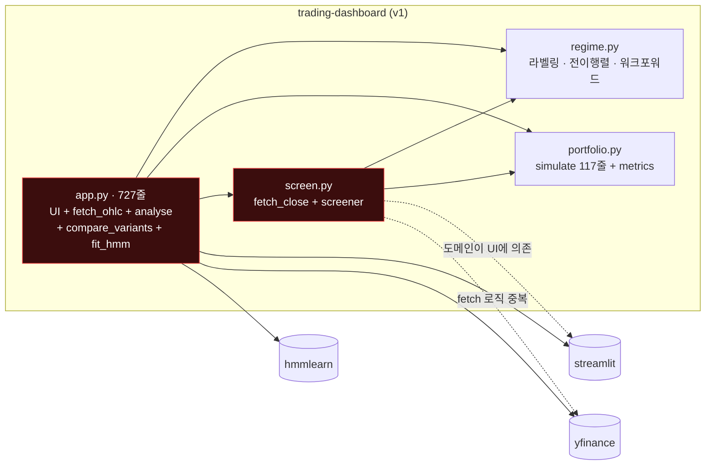

빨간 노드 두 개가 문제의 중심이다. `app.py`에는 모든 책임이 몰려 있다. `screen.py`는 도메인 로직인데 Streamlit 캐시 데코레이터와 yfinance 호출을 직접 품고 있다. 그래서 **네트워크 없이 테스트할 수 있는 단위가 거의 없다.**

---

## 2. ECC는 무엇이고 이번에 무엇을 썼나

**ECC**는 Claude Code용 "에이전트 하네스 OS" 플러그인이다(`affaan-m/ECC`, v2.2.2). 전문 에이전트 68개, 스킬 292개, 커맨드 94개, 훅, 규칙(rules)이 한 번에 설치된다. 이번 작업의 뼈대는 **오케스트레이션 스킬 `orch-*`**였다. 그 밖에 실제로 쓴 기능은 다음과 같다.

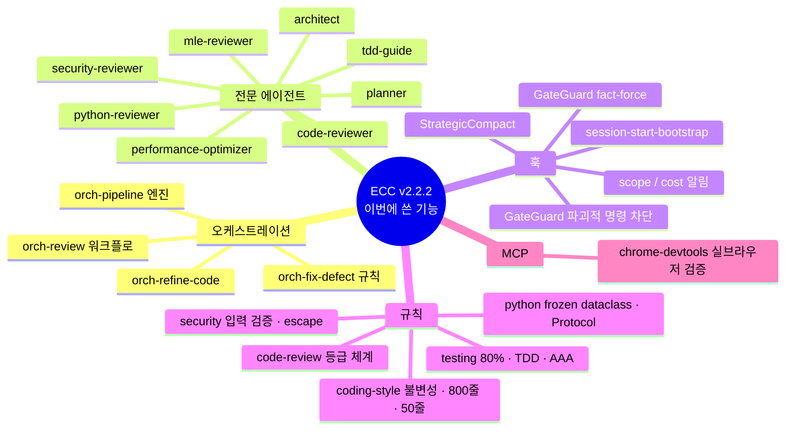

### 오케스트레이션 외에 쓴 ECC 기능 상세

| 분류 | 기능 | 이번 작업에서 한 일 |
|---|---|---|
| **에이전트** | `ecc:architect` | v2의 3계층 설계, 의존 방향 규칙, 트레이드오프 표 작성 → `docs/architecture.md` |
| | `ecc:planner` | 감사 결과를 수직 슬라이스 task_list(T0–T10)로 정리. 태스크마다 RED 테스트 명시 |
| | `ecc:mle-reviewer` | 백테스트 정합성 감사. 숏 이중 수수료, Sharpe 불일치 등 11건을 **수치 예시와 함께** 지적 |
| | `ecc:python-reviewer` | 구조·품질 감사 12건. 구현 후에는 **"항상 참인 테스트"를 두 번** 찾아냄 |
| | `ecc:security-reviewer` | 서버가 외부 IP로 노출된 것, 이스케이프 없는 HTML, 입력 검증 누락 지적 |
| | `ecc:tdd-guide` | 슬라이스 4개를 RED→GREEN→REFACTOR로 구현. TDD 로그 1,150줄 이상 |
| | `ecc:code-reviewer` / `ecc:performance-optimizer` | Phase 5 최종 리뷰. 성능 관점이 스크리너의 6배 중복 계산을 찾음 |
| **훅** | `session-start-bootstrap` | 세션 시작 시 "Python 프로젝트" 자동 감지 |
| | **GateGuard** (`gateguard-fact-force`) | 파일마다 **첫 Write/Edit/셸 호출 전에** "누가 이 파일을 import하나? 스키마는? 사용자 지시 원문은?"을 답하게 강제. 이번 세션에서 **20회 이상** 발동 |
| | GateGuard 파괴적 명령 검사 | `git checkout -- REPORT.md`를 실행하려 하자 **수정 대상과 롤백 절차를 먼저 적게 함** (8장 사고 참고) |
| | scope / cost 알림, StrategicCompact | "이 세션에서 21개 파일 수정", "세션 비용 ~$5.77", "도구 호출 200회, /compact 고려" 같은 알림 |
| **규칙** | `rules/common/testing.md` | 커버리지 80% 이상, TDD, AAA 구조 → `--cov-fail-under=80` |
| | `rules/common/coding-style.md` | 불변성, 파일 800줄 / 함수 50줄 상한, 중첩 4단계 이하 → v2의 수용 기준 |
| | `rules/common/security.md`, `code-review.md` | 입력 검증·escape 기준, CRITICAL/HIGH/MEDIUM/LOW 등급 체계 |
| | `rules/python/*` | `@dataclass(frozen=True)`, `Protocol`, pytest, ruff |
| **MCP** | `chrome-devtools` (ECC 번들) | v1/v2를 **실제 브라우저로 띄워 비교**하고 이 글의 스크린샷을 캡처. 여기서 패키징 결함을 발견함 |

> **솔직한 소감.** GateGuard는 처음엔 번거롭다. 파일마다 첫 수정 전에 사실 4가지를 적어야 한다. 그런데 "이 함수를 누가 호출하지?"를 적다 보면 실제로 grep을 한 번 더 하게 되고, `git checkout` 같은 되돌리기 전에 한 번 멈추게 된다. 속도보다 안전 쪽으로 기울어진 훅이다.
{: .prompt-info }

---

## 3. 오케스트레이션: `/orch-refine-code` 파이프라인

ECC의 `orch-*` 스킬 5종(add-feature / change-feature / fix-defect / refine-code / build-mvp)은 **공통 엔진 `orch-pipeline`** 위의 얇은 래퍼다. 공통 엔진은 요청 크기를 분류하고, 실행할 phase를 고르고, 각 phase를 전문 에이전트에게 위임한다. 핵심은 **게이트 두 개**다. 계획 승인(GATE 1) 전에는 구현 코드를 쓰지 않고, 커밋 승인(GATE 2) 전에는 커밋하지 않는다.

이번 작업은 "동작은 유지하고 구조를 개선"하는 일이라 `orch-refine-code`를 골랐다. 그런데 감사하다 보니 백테스트 결함이 나왔다. 결함에는 `orch-fix-defect`의 규칙인 **"실패하는 회귀 테스트를 먼저 쓴다"**를 따로 적용했다. 여러 파일, 백테스트 계약 변경, 외부 API·사용자 입력이라는 보안 트리거가 겹쳐 크기 분류는 **large**였다.


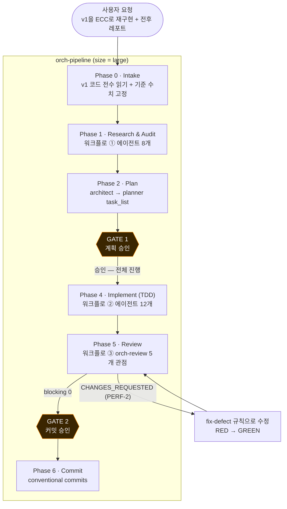


세 개의 워크플로는 모두 Claude Code의 **Workflow 도구**(결정적 JS 스크립트로 서브에이전트를 조율하는 기능)로 실행했다. 스크립트 원본은 `docs/workflows/01~03-*.js`에 있다.

---

## 4. Phase 1: 에이전트 8개가 v1을 감사하다

첫 워크플로 `markov-v1-audit-and-plan`은 전문 리뷰어 3명과 아키텍트를 **병렬**로 띄운다. 리뷰어가 CRITICAL/HIGH로 올린 지적은 **별도의 검증 에이전트가 반박을 시도**하게 했다. 그럴듯하지만 틀린 지적이 계획에 섞이지 않게 하려는 장치다.


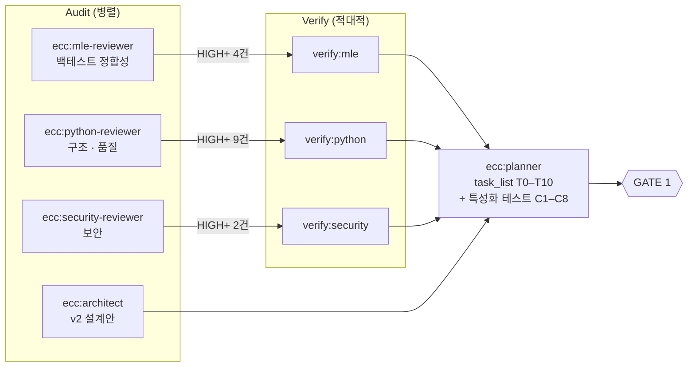


`pipeline()`으로 짰기 때문에 리뷰어별로 끝나는 즉시 검증이 시작된다. 다른 리뷰어를 기다리지 않는다. 에이전트 8개가 **8.7분** 만에 끝났다.

### 결과: 30건, 적대적 검증 후 재분류

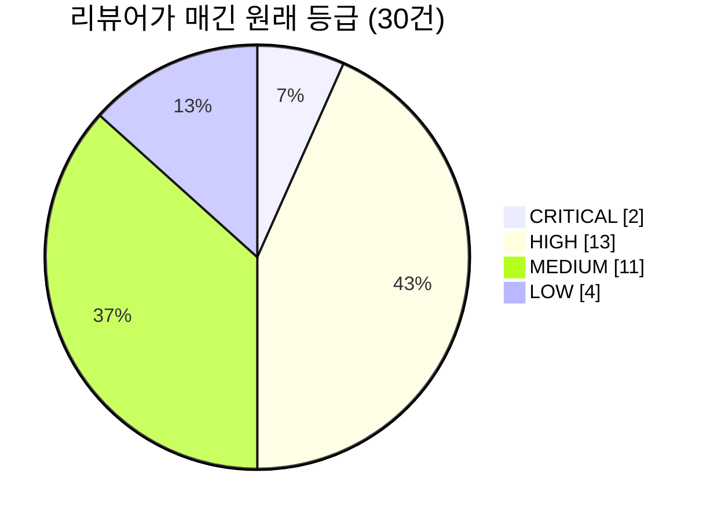

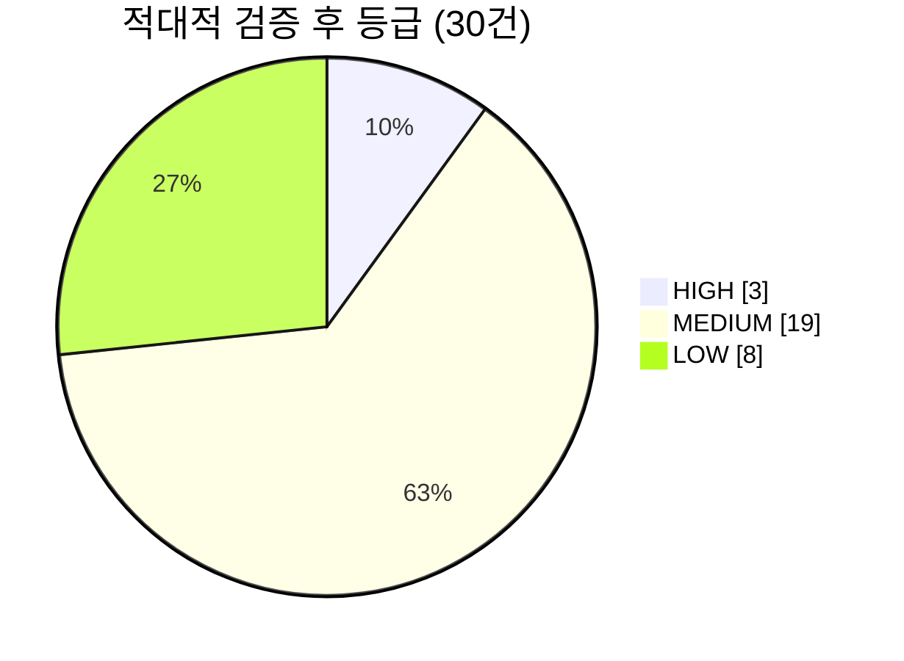

검증 대상 15건 가운데 **반박된 것은 0건**이었다. 하지만 **11건은 등급이 내려갔다**. 예를 들어 `PY-001`(도메인이 streamlit을 import)은 CRITICAL로 올라왔는데, 검증 에이전트가 "`st.cache_data`는 Streamlit 런타임 밖에서도 경고만 내고 동작한다. 테스트 불가는 과장이다"라는 근거로 MEDIUM으로 내렸다. 한 리뷰어의 판단을 그대로 믿지 않는 구조가 실제로 작동했다.

### 검증을 통과한 주요 결함

| ID | 확정 등급 | 내용 | 수치 근거 |
|---|---|---|---|
| MLE-1 | HIGH | **숏 진입 시 수수료가 두 번 차감됨** | 자본 1만 달러, 10bps 기준으로 진입 직후 롱 9,990.01달러 vs 숏 9,980.02달러 |
| MLE-2 | HIGH | **Sharpe는 수수료 미반영 수익률로, 수익률·MDD는 수수료 반영 equity로 계산**. 스크리너가 이 Sharpe로 통과 여부를 판정 | 지표 간 기준이 서로 다름 |
| PY-012 | HIGH | 테스트 0개 | 커버리지 0% |
| MLE-4 | MEDIUM | 처음 20일(롤링 NaN 구간)이 **Sideways로 오염됨**. `.dropna()`가 아무것도 하지 않음 | `pd.Series(1, ...)`로 초기화했기 때문 |
| MLE-5 | MEDIUM | `total_fees`가 실제로는 **거래 손익의 합계**. `if False` 잔재 | SPY: 9,126달러로 표시, 실제 수수료는 1,653달러 |
| MLE-6 | MEDIUM | 암호화폐도 √252로 연율화 | BTC는 365일 거래 |
| MLE-3 | LOW | 워크포워드 경계 전이 1건이 영구 누락 (off-by-one) | `range(min_train - 1)` |
| SEC-001 | MEDIUM | Streamlit이 모든 인터페이스에 바인딩되어 외부 IP까지 노출 | 로그: `Uvicorn server started on :::8501`, External URL 표시 |
| SEC-003/004 | MEDIUM | 사용자 입력 티커를 `unsafe_allow_html` HTML에 escape 없이 삽입, 입력 검증 없음 | |

전체 30건은 `docs/audit_v1.md`에 있다.

---

## 5. 설계 비교: Before vs After

### 5-1. 모듈 구조: 한 덩어리에서 3계층으로

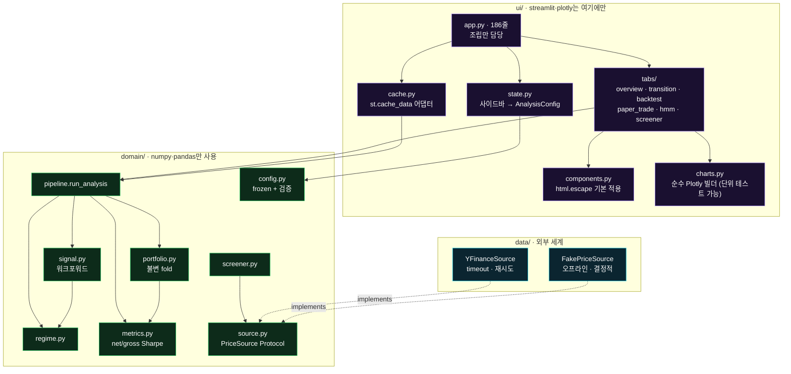

핵심은 **의존 방향이 한쪽**이라는 점이다. `ui → domain ← data`. `domain`은 streamlit, plotly, yfinance를 절대 import하지 않는다. 이 규칙은 `tests/test_architecture.py`가 **AST로 검사해서 강제**한다. 관례로 지키는 규칙이 아니라 어기면 테스트가 실패하는 규칙이다.

### 5-2. 데이터 흐름: 호출 한 번에 무슨 일이 일어나나

**Before**: `app.py`가 모든 단계를 직접 처리한다.

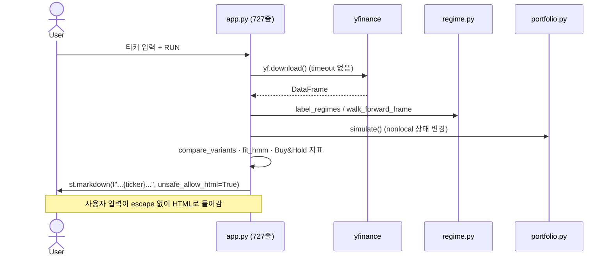

**After**: 경계마다 검증하고, 도메인은 순수 함수다.

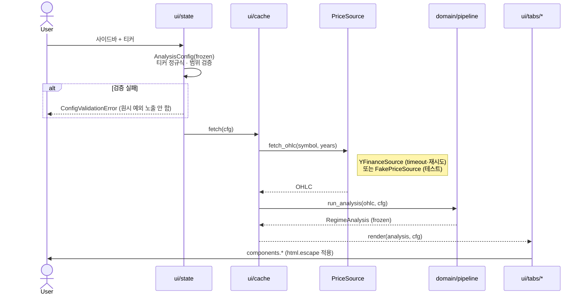

`PriceSource`를 Protocol로 주입받기 때문에 테스트는 `FakePriceSource`로 **네트워크 없이** 6개 탭 전체를 렌더링한다(`streamlit.testing.AppTest`).

### 5-3. 포트폴리오 시뮬레이터: 가변 클로저에서 불변 fold로

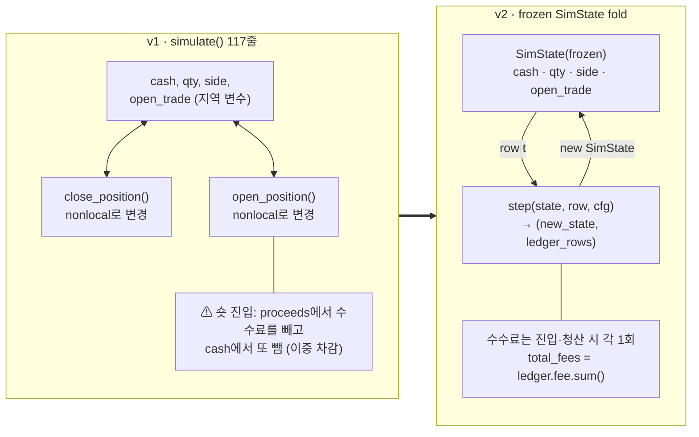

수정 전후 코드 핵심만 보면 다음과 같다.

```python
# v1 — 숏 진입 (portfolio.py:79)
proceeds = -new_qty * price * (1 - fee_rate)              # 수수료 1회 차감
cash = equity + proceeds - (-new_qty * price * fee_rate)  # ← 한 번 더 차감

# v2 — domain/portfolio.py
cash = equity + proceeds  # proceeds에 이미 수수료가 반영됨 (1회)
```

이 수정은 **실패하는 테스트가 먼저**였다. `test_long_short_open_close_symmetric_fee_loss`는 같은 금액을 롱과 숏으로 진입했다가 즉시 청산하면 손실이 같아야 한다고 단언한다. v1 공식에서는 이 테스트가 실패한다.

### 5-4. 워크포워드 타임라인: 워밍업과 경계 전이

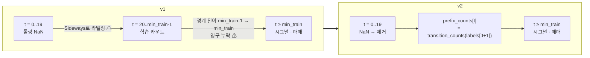

v2에서는 "t 시점에 쓰는 카운트는 t까지 관측된 전이의 전부"라는 **인과성 불변식**이 테스트로 고정된다(C8: 미래 라벨을 바꿔도 과거 포지션이 변하지 않는지 검사).

---

## 6. Phase 4: TDD로 다시 짓기 (에이전트 12개, 129분)

두 번째 워크플로는 슬라이스끼리 의존 관계가 있어서 **순차 파이프라인**으로 짰다. 각 슬라이스는 `tdd-guide`가 구현하고, 리뷰어가 검토하고, HIGH 이상이 있으면 `tdd-guide`가 다시 고치는 루프다.

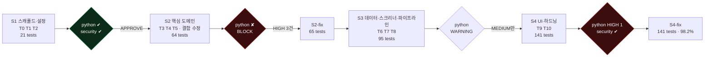

| 슬라이스 | 구현 | 리뷰 | 수정 | 테스트 |
|---|---|---|---|---|
| S1 스캐폴드·설정 | 18분 | 3분 | — | 21 |
| S2 핵심 도메인 | 14분 | 3분 | 5분 | 65 |
| S3 데이터·스크리너 | 18분 | 4분 | — | 95 |
| S4 UI·하드닝 | 약 55분 | 약 5분 | 약 5분 | 141 |

### 리뷰어가 잡은 것: "통과하지만 아무것도 검증하지 않는 테스트"

이번 작업에서 가장 인상적이었던 장면이다. **테스트는 GREEN인데 테스트 자체가 무의미한 경우를 리뷰어가 두 번 잡았다.**

1. **S2 (BLOCK)**: `test_trade_pnl_matches_ledger_cash`가 `close_row["equity"] == close_row["cash"]`(청산 후에는 항상 참)만 확인하고 있었다. 수정 에이전트는 테스트를 강화한 뒤 **구현을 일부러 v1 공식으로 되돌려 테스트가 실제로 실패하는지 확인**했다(RED: −1011.98 vs 970.04). 확인 후 원복했다. 사실상 수동 뮤테이션 테스트다.
2. **S4 (HIGH)**: `assert " 0.5" 필터도 이 값으로 판정했다.
- **`total_fees` (MLE-5)**: v1 값은 거래 손익의 합계였다. 실제 수수료는 그 5~11분의 1 수준이다.
- **Long/Short 수익률이 오른 이유 (MLE-1)**: 숏 이중 수수료가 사라졌다. SPY는 손실에서 이익으로 바뀌었다.
- **BTC Sharpe가 오른 이유 (MLE-6)**: 연율화 기준이 252일에서 365일로 바뀌었다(√(365/252) ≈ 1.20배).
- **Long/Cash 수익률이 달라진 이유 (MLE-4)**: 워밍업 20봉을 제거하면서 평가 구간이 20거래일 뒤로 밀렸다. 같은 입력을 넣었을 때 롱 전용 equity가 v1과 완전히 같다는 것은 특성화 테스트 C6/C7이 보장한다.

### 7-3. 화면은 그대로


같은 SPY, 같은 설정이다. 레이아웃, 색상, 차트, 패널은 v1과 같다. 달라진 점은 **PERFORMANCE 패널에 `SHARPE (NET)`과 `SHARPE (GROSS)`가 나뉘어 표시**된다는 것이다(v1: 0.77 하나 → v2: 0.65 / 0.76). 실데이터 기준 전략 수익률은 +97.5%에서 +92.5%로 바뀌었다(워밍업 제거 효과).


---

## 8. 잘 안 된 것들 (실패 기록)

블로그에서 가장 중요하다고 생각하는 부분이다. 오케스트레이션은 강력했지만 공짜가 아니었고, 사고도 있었다.

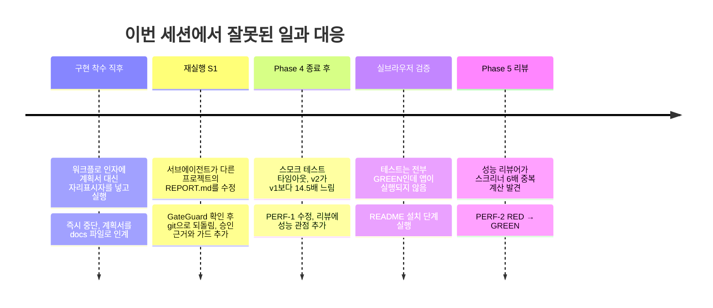

### ① 서브에이전트가 "누구의 지시인가"를 헷갈렸다

두 번째로 띄운 구현 워크플로의 S1 에이전트는 코드를 한 줄도 쓰지 않았다. 대신 **다른 프로젝트(라우팅 에이전트)의 `REPORT.md`에 22줄을 덧붙였다.** 워크플로 서브에이전트는 세션의 최신 사용자 발화도 함께 받는데, 마침 그 직전에 "ECC 기능도 레포트에 적어줘"라고 말해 둔 참이었다. 워크플로 프롬프트에는 "이 구현이 사용자가 승인한 작업"이라는 근거가 없었다. 그래서 에이전트는 스크립트의 지시보다 사용자 발화를 우선했다. 자기 규칙대로 행동한 셈이다.

- **복구**: `git checkout -- REPORT.md`로 되돌렸다. 이때 **GateGuard가 파괴적 명령을 감지**해 "수정될 파일 목록, 롤백 절차, 사용자 지시 원문"을 먼저 적게 했다.
- **재발 방지**: 워크플로 프롬프트에 `AUTHORIZATION:` 문단을 넣었다(GATE 1 승인 사실, 금지 범위). 또 결정적 가드를 추가했다. 구현 에이전트가 테스트 0건을 보고하거나 v2 폴더 밖의 파일을 건드리면 워크플로를 즉시 중단한다.

> 교훈: **멀티 에이전트에서 권한은 프롬프트에 명시해야 한다.** "무엇을 하라"만 적어서는 부족하다. "왜 이게 사용자의 뜻인지"와 "무엇을 하지 말아야 하는지"도 적어야 한다.
{: .prompt-tip }

### ② 리뷰어가 모두 놓친 14.5배 성능 회귀 (PERF-1)

Phase 4의 리뷰어(python, security)는 모두 통과를 줬다. 그런데 최종 점검에서 AppTest 스모크 테스트가 60초 타임아웃으로 실패했다. 프로파일링 결과는 다음과 같았다.

| | SPY 10년 분석 |
|---|---|
| v1 | 1.5초 (콜드 스타트 4.0초) |
| v2 (수정 전) | **57.9초**. 이 중 45.9초가 `transition_counts()` 11,206회 호출 |
| v2 (수정 후) | **0.76초** |

원인은 **불변성 규칙을 과하게 적용한 것**이었다. v1은 카운트 배열을 누적해서 갱신(mutation)했다. v2는 mutation을 없애려고 매 시점마다 `labels[:t+1]`로 카운트를 처음부터 다시 계산했다. O(n²)가 된 것이다. 수정은 누적합 한 번이다.

```python
def cumulative_transition_counts(labels) -> np.ndarray:
    """result[t] == transition_counts(labels[: t + 1]) — O(n), 불변."""
    arr = np.asarray(labels, dtype=int)
    pair_ids = arr[:-1] * 3 + arr[1:]
    one_hot = np.eye(9)[pair_ids]
    prefix = np.vstack([np.zeros((1, 9)), np.cumsum(one_hot, axis=0)])
    return prefix.reshape(arr.size, 3, 3)
```

불변성과 성능을 **둘 다** 지킬 수 있었다. 다만 리뷰 파이프라인에 **성능을 보는 눈이 없었다.** 그래서 Phase 5에서는 ECC의 `orch-review` 워크플로를 복사해 `performance`(`ecc:performance-optimizer`)와 `backtest`(`ecc:mle-reviewer`) 관점을 추가했다. 추가한 성능 관점은 **곧바로 다음 결함을 찾아냈다.**

### ③ 성능 관점이 찾은 스크리너 6배 중복 계산 (PERF-2)

SCREENER 탭은 `screen_universe()`가 종목마다 이미 가격을 받고 백테스트까지 끝낸 뒤에, 표시용 지표를 얻으려고 **같은 종목을 다시 받아와 전체 파이프라인(전략 변형 4개 포함)을 다시 실행**하고 있었다. 네트워크 호출은 2배, 백테스트는 약 6배였다. 검증 에이전트도 확신도 0.9로 "실제 문제"라고 확인했다. 수정은 도메인 스크리너가 이미 계산한 `Metrics`를 버리지 않고 반환하게 하는 것이다(RED 4건 → GREEN).

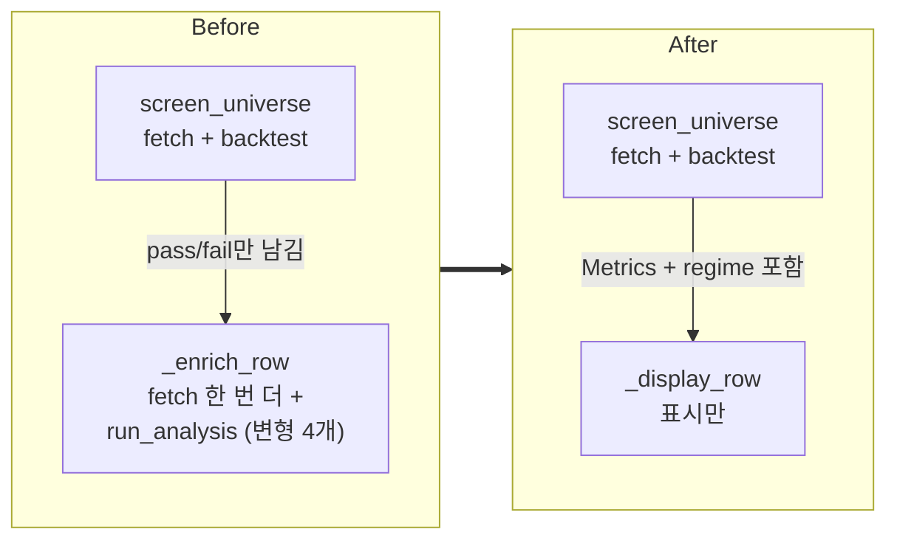

### ④ 테스트는 전부 GREEN, 앱은 실행되지 않았다

마지막으로 v1과 v2를 **실제 브라우저로** 띄웠다(ECC 번들 chrome-devtools MCP). v2는 `ModuleNotFoundError: No module named 'markov_regime'`으로 시작조차 되지 않았다. pytest 설정의 `pythonpath = ["src"]`가 패키지 미설치를 가려 주고 있었던 것이다. README에는 `pip install -e ".[hmm,dev]"`가 적혀 있었지만 **어떤 에이전트도 실제로 실행하지 않았다.**

> 교훈: **"테스트 통과"와 "앱이 뜬다"는 다른 명제다.** 파이프라인 마지막에 실제 실행 단계를 넣어야 한다.
{: .prompt-tip }

### ⑤ 그 밖에 남은 것들 (알려진 차이)

- **UI 소소한 차이**: 제목 옆 티커 표시, 우측 안내 문구, 사이드바 도움말(ⓘ)이 빠졌다. "5-STEP / IN 5D"는 "N-STEP / AHEAD"로 바뀌었다. 에이전트가 넣은 한국어 오타("숨", "둘니다", "바꾴")는 브라우저로 확인하면서 고쳤다.
- **Advisory (MEDIUM)**: 시그널을 계산한 종가와 같은 종가에 체결한다고 가정한다(same-bar fill). v1과 같은 가정이며, 룩어헤드는 아니지만 슬리피지가 반영되지 않는다.
- **Advisory (LOW)**: 쓰이지 않는 `buy_hold_metrics()`, UI 탭 private 헬퍼의 타입 힌트 누락, 벽시계 시간 기반 성능 테스트가 CI 부하에 따라 흔들릴 가능성.

---

## 9. 비용과 시간

| 워크플로 | 에이전트 | 서브에이전트 토큰 | 소요 |
|---|---|---|---|
| ① 감사 + 설계 + 계획 | 8 | 약 46만 | 8.7분 |
| ② TDD 구현 (S1–S4) | 12 | 약 138만 (도구 호출 668회) | 129분 |
| ③ orch-review (5개 관점 + 검증) | 6 | 약 51만 | 5.5분 |
| **합계** | **26** | **약 235만 이상** | 약 2.4시간 |

중단된 두 번의 실행(자리표시자 사고, 권한 혼동 사고)은 합계에서 뺐다. 테스트 148개와 감사 30건을 이 시간에 얻은 것은 분명한 이득이다. 반면 GateGuard 때문에 파일 수정 호출이 두 번씩 나간 경우가 많았고, 사고 두 건을 수습하는 시간도 들었다.

---

## 10. 마치며: ECC 오케스트레이션을 써 보고

**좋았던 점**

1. **게이트가 있는 자율성.** GATE 1(계획)과 GATE 2(커밋) 사이는 알아서 흘러간다. 사람은 계획과 결과만 승인하면 된다.
2. **적대적 검증.** 리뷰어 한 명의 CRITICAL을 그대로 믿지 않는다. 30건 중 11건의 등급이 조정됐다.
3. **리뷰어가 테스트를 리뷰한다.** "항상 참인 테스트"는 사람도 놓치기 쉬운데, 두 번이나 잡혔다.
4. **계획 문서가 곧 인계물.** `architecture.md`, `task_list.md`, `audit_v1.md`, `tdd-log.md`가 에이전트 사이의 유일한 상태이고, 그대로 이 글의 재료가 되었다.

**조심할 점**

1. **리뷰 관점은 스스로 구성해야 한다.** 기본 조합(quality·language·security)으로는 성능 회귀를 잡지 못했다. 도메인에 맞는 관점(여기서는 성능, 백테스트)을 추가하자.
2. **서브에이전트의 권한은 명시적으로 준다.** 그리고 결정적 가드(파일 범위, 테스트 수)로 한 번 더 막는다.
3. **실제로 실행해 본다.** GREEN은 필요조건일 뿐이다.
4. **규칙을 과하게 적용하지 않는다.** 불변성 규칙이 O(n²)를 낳았다. 규칙은 목적(부작용 없는 코드)을 지키는 방법 중 하나일 뿐이다.

v1은 "돌아가는 코드"였고, v2는 "**왜 맞는지 증명할 수 있는 코드**"다. v1이 보여 주던 Sharpe 0.79는 수수료를 반영하면 0.65 남짓이었다. 이걸 알게 된 것만으로도 다시 만든 보람이 있다.

---

### 부록: 저장소 구성

```
markov-regime-v2/
├─ app.py                     # 진입점 (186줄)
├─ src/markov_regime/
│  ├─ domain/                 # 순수 로직 (streamlit/yfinance 금지)
│  ├─ data/                   # YFinanceSource · FakePriceSource
│  └─ ui/                     # theme · components · charts · state · cache · tabs/
├─ tests/                     # 148 tests · characterization/ · fixtures/
├─ docs/
│  ├─ architecture.md         # ecc:architect
│  ├─ task_list.md            # ecc:planner
│  ├─ audit_v1.md             # Phase 1 감사 30건
│  ├─ tdd-log.md              # RED/GREEN 기록
│  └─ workflows/01~03-*.js    # 오케스트레이션 스크립트 원본
└─ report/REPORT.md           # 이 글
```

실행 방법:

```bash
python -m venv .venv
.venv\Scripts\python.exe -m pip install -e ".[hmm,dev]"   # ← 이 단계를 빼먹지 말 것 (8장 ④)
.venv\Scripts\python.exe -m pytest --cov=markov_regime     # 148 passed, 98%
run_dashboard.bat                                          # http://127.0.0.1:8501
```

> 과거 백테스트는 미래 수익을 보장하지 않는다. 이 글의 수치는 코드 품질 비교용이며 투자 조언이 아니다.
{: .prompt-warning }
